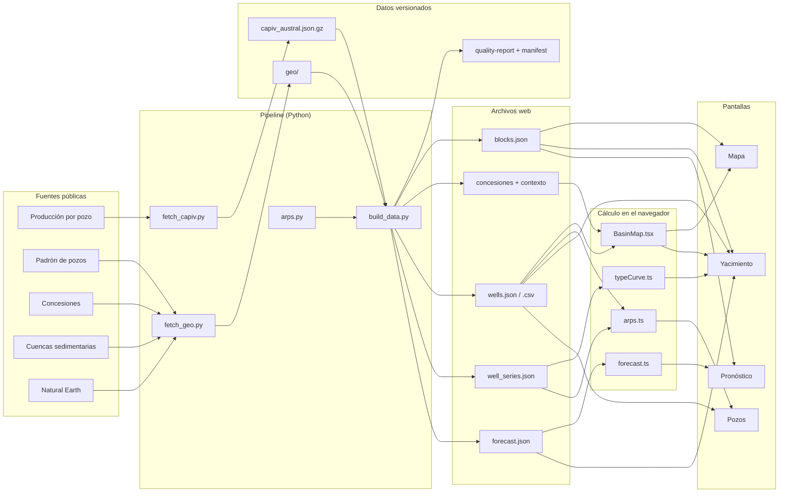

# Arquitectura

> Generado por `scripts/anclas.mjs` desde `src/didactica/datos/`. No editar a mano.

La versión interactiva está en la app: https://mpodeley.github.io/cuenca-austral/#/como-se-hizo/arquitectura

## Fuentes públicas

Lo que publica el Estado, tal cual.

- **Producción por pozo** — Un CSV por año (2006–2026) con la producción mensual de cada pozo del país: unos 300 MB cada uno. [fuente](https://datos.energia.gob.ar/dataset/produccion-de-petroleo-y-gas-por-pozo)
- **Padrón de pozos** — Listado de pozos con coordenadas, profundidad y estado, más el padrón de primera producción. [fuente](https://datos.energia.gob.ar/dataset/produccion-de-petroleo-y-gas-por-pozo)
- **Concesiones** — Shapefile nacional con el polígono de cada concesión de explotación. No trae superficie ni cuenca. [fuente](https://datos.energia.gob.ar/dataset/produccion-hidrocarburos-concesiones-de-explotacion)
- **Cuencas sedimentarias** — Contorno oficial de la Cuenca Austral. [fuente](https://datos.energia.gob.ar/dataset/exploracion-hidrocarburos-cuencas-sedimentarias)
- **Natural Earth** — Tierra firme y límite internacional, de dominio público. Reemplaza a un mapa base de teselas. [fuente](https://www.naturalearthdata.com/)

## Pipeline (Python)

Scripts que bajan y calculan.

- **fetch_capiv.py** — Lee cada CSV anual por streaming, se queda con las filas de la cuenca y suma por pozo y mes. [`pipeline/fetch_capiv.py`](pipeline/fetch_capiv.py#L98)
- **fetch_geo.py** — Baja pozos, concesiones, cuenca y costa; calcula superficies y recorta la costa a la región. [`pipeline/fetch_geo.py`](pipeline/fetch_geo.py#L195)
- **arps.py** — El modelo de declinación: ajuste, proyección y EUR con banda. Los supuestos son constantes al principio del archivo. [`pipeline/arps.py`](pipeline/arps.py#L35)
- **build_data.py** — Arma todo lo que consume la web: pozos, bloques, pozos tipo y base del pronóstico. Corta con error si falta un mes. [`pipeline/build_data.py`](pipeline/build_data.py#L461)

## Datos versionados

Insumos compactos guardados en Git.

- **capiv_austral.json.gz** — Toda la producción mensual de la cuenca en 2,6 MB. Evita volver a bajar 6 GB. [`data/store/capiv_austral.json.gz`](data/store/capiv_austral.json.gz)
- **geo/** — Pozos, concesiones, cuenca y contexto ya recortados. [`data/store/geo`](data/store/geo)
- **quality-report + manifest** — Qué controles pasaron y de qué archivo oficial salió cada año. [`data/processed/quality-report.md`](data/processed/quality-report.md)

## Archivos web

Lo que baja el navegador.

- **blocks.json** — Una ficha por bloque: pozos, producción, EUR, etapa. 39 kB. [`public/data/blocks.json`](public/data/blocks.json)
- **concesiones + contexto** — Polígonos de concesiones, costa y contorno de cuenca. [`public/data/concesiones_austral.json`](public/data/concesiones_austral.json)
- **wells.json / .csv** — Un registro por pozo con su ajuste y su EUR. Se baja después del mapa base. [`public/data/wells.json`](public/data/wells.json)
- **well_series.json** — La tasa de cada mes de cada pozo. Es el archivo más pesado: se baja sólo cuando un gráfico lo necesita. [`public/data/well_series.json`](public/data/well_series.json)
- **forecast.json** — Por bloque: historia, base declinante a 20 años y pozo tipo. [`public/data/forecast.json`](public/data/forecast.json)

## Cálculo en el navegador

Lo que se recalcula al mover un control.

- **BasinMap.tsx** — El mapa SVG: proyección, paneo, zoom y qué hay bajo el cursor. [`src/components/BasinMap.tsx`](src/components/BasinMap.tsx#L58)
- **typeCurve.ts** — Pozo tipo en vivo: percentiles por mes en producción. [`src/utils/typeCurve.ts`](src/utils/typeCurve.ts#L16)
- **arps.ts** — Evalúa la curva ya ajustada. El navegador no ajusta: sólo dibuja. [`src/utils/arps.ts`](src/utils/arps.ts#L8)
- **forecast.ts** — El motor del pronóstico: cronograma de pozos nuevos y su producción. [`src/utils/forecast.ts`](src/utils/forecast.ts#L63)

## Pantallas

Lo que ves.

- **Mapa** — Concesiones y pozos. [`src/components/Mapa.tsx`](src/components/Mapa.tsx#L112)
- **Yacimiento** — Ficha por campo u operadora. [`src/components/Campos.tsx`](src/components/Campos.tsx#L29)
- **Pozos** — Declinación, ficha y tabla. [`src/components/Pozos.tsx`](src/components/Pozos.tsx#L140)
- **Pronóstico** — Escenarios de cuenca y campo. [`src/components/Pronostico.tsx`](src/components/Pronostico.tsx#L28)

## Módulos de la app

Cada módulo de la app tiene un botón «cómo se hizo» que abre esta misma información.

| Módulo | Qué hace | Recorrido del dato | Código |
| --- | --- | --- | --- |
| Mapa de concesiones y pozos | Dibuja la cuenca sin depender de ningún servicio de mapas: costa, concesiones y cada pozo en su ubicación de superficie. Se puede acercar, mover y tocar. | Padrón de pozos → Concesiones → Cuencas sedimentarias → Natural Earth → fetch_geo.py → geo/ → build_data.py → concesiones + contexto → wells.json / .csv → BasinMap.tsx → Mapa | [`src/components/BasinMap.tsx`](src/components/BasinMap.tsx#L58) `BasinMap` [`src/components/BasinMap.tsx`](src/components/BasinMap.tsx#L41) `WellDots` [`src/hooks/usePanZoom.ts`](src/hooks/usePanZoom.ts#L20) `usePanZoom` [`src/utils/geo.ts`](src/utils/geo.ts#L9) `projY` [`pipeline/fetch_geo.py`](pipeline/fetch_geo.py#L133) `fetch_concessions` [`pipeline/fetch_geo.py`](pipeline/fetch_geo.py#L167) `fetch_context` |
| Qué se colorea | Pinta los bloques según una métrica (producción, EUR, agotamiento, actividad) y los pozos según estado, fluido, campaña, ambiente o tipo. | build_data.py → blocks.json → wells.json / .csv → BasinMap.tsx → Mapa | [`src/components/Mapa.tsx`](src/components/Mapa.tsx#L18) `METRICS` [`src/components/Mapa.tsx`](src/components/Mapa.tsx#L40) `wellPalette` [`src/utils/geo.ts`](src/utils/geo.ts#L54) `quantileBreaks` |
| Buscador y tooltips | Encuentra un bloque por nombre u operadora y muestra un resumen al pasar el cursor por un bloque o un pozo. | build_data.py → blocks.json → wells.json / .csv → Mapa | [`src/components/Mapa.tsx`](src/components/Mapa.tsx#L69) `BlockTooltip` [`src/components/Mapa.tsx`](src/components/Mapa.tsx#L94) `WellTooltip` [`src/components/Mapa.tsx`](src/components/Mapa.tsx#L112) `Mapa` |
| Indicadores del campo | Resume un campo o una operadora en seis números: pozos, producción de hoy, acumulada, EUR, superficie y actividad reciente. | Producción por pozo → fetch_capiv.py → capiv_austral.json.gz → arps.py → build_data.py → blocks.json → Yacimiento | [`pipeline/build_data.py`](pipeline/build_data.py#L251) `build_blocks` [`pipeline/fetch_geo.py`](pipeline/fetch_geo.py#L37) `polygon_area_km2` [`src/components/Campos.tsx`](src/components/Campos.tsx#L18) `mergeFluid` [`src/components/Campos.tsx`](src/components/Campos.tsx#L29) `Campos` |
| Mapa del campo | El mismo mapa, encuadrado en el campo elegido, con sus pozos. | fetch_geo.py → geo/ → build_data.py → concesiones + contexto → wells.json / .csv → BasinMap.tsx → Yacimiento | [`src/components/BasinMap.tsx`](src/components/BasinMap.tsx#L58) `BasinMap` [`src/utils/geo.ts`](src/utils/geo.ts#L46) `pad` [`pipeline/build_data.py`](pipeline/build_data.py#L66) `derived_polygon` |
| Historia de producción | Muestra la producción del campo mes a mes desde 2006, cuántos pozos estaban activos y cómo seguiría sin perforar más. | Producción por pozo → fetch_capiv.py → capiv_austral.json.gz → arps.py → build_data.py → forecast.json → Yacimiento | [`pipeline/fetch_capiv.py`](pipeline/fetch_capiv.py#L98) `stream_year` [`pipeline/build_data.py`](pipeline/build_data.py#L187) `history` [`pipeline/build_data.py`](pipeline/build_data.py#L169) `well_projection` [`pipeline/build_data.py`](pipeline/build_data.py#L347) `quality` |
| Actividad por campaña | Cuenta cuántos pozos entraron en producción cada año. | Producción por pozo → fetch_capiv.py → capiv_austral.json.gz → build_data.py → forecast.json → Yacimiento | [`pipeline/build_data.py`](pipeline/build_data.py#L103) `build_wells` [`pipeline/build_data.py`](pipeline/build_data.py#L251) `build_blocks` |
| Pozo tipo en vivo | Arma el pozo «típico» del campo: cómo produce un pozo mes a mes desde que arranca, con la banda entre los mejores y los peores. | Producción por pozo → fetch_capiv.py → capiv_austral.json.gz → build_data.py → well_series.json → typeCurve.ts → Yacimiento | [`src/utils/typeCurve.ts`](src/utils/typeCurve.ts#L16) `computeTypeCurve` [`pipeline/build_data.py`](pipeline/build_data.py#L203) `type_profile` |
| Distribución de EUR | Muestra cuántos pozos hay de cada tamaño: pocos pozos muy buenos y muchos chicos. | arps.py → build_data.py → wells.json / .csv → Yacimiento | [`pipeline/arps.py`](pipeline/arps.py#L94) `eur` [`src/components/Campos.tsx`](src/components/Campos.tsx#L29) `Campos` |
| Tabla de pozos o de campos | Lista los pozos con mayor EUR del campo, o los campos de la operadora. Cada fila lleva a su detalle. | build_data.py → wells.json / .csv → blocks.json → Yacimiento | [`src/components/Campos.tsx`](src/components/Campos.tsx#L29) `Campos` [`src/App.tsx`](src/App.tsx#L37) `routeHash` |
| Declinación del pozo | Muestra la producción real del pozo, la curva que mejor la describe y hacia dónde va, con una banda de incertidumbre. | Producción por pozo → fetch_capiv.py → capiv_austral.json.gz → arps.py → build_data.py → well_series.json → wells.json / .csv → arps.ts → Pozos | [`pipeline/arps.py`](pipeline/arps.py#L35) `fit` [`pipeline/arps.py`](pipeline/arps.py#L67) `project` [`src/components/Pozos.tsx`](src/components/Pozos.tsx#L36) `declineRows` [`src/utils/arps.ts`](src/utils/arps.ts#L5) `hyperbolic` |
| Ficha del pozo | Los datos declarados del pozo y lo que se estimó para él: EUR, banda, confianza y parámetros del ajuste. | Producción por pozo → Padrón de pozos → fetch_capiv.py → fetch_geo.py → arps.py → build_data.py → wells.json / .csv → Pozos | [`pipeline/arps.py`](pipeline/arps.py#L94) `eur` [`pipeline/build_data.py`](pipeline/build_data.py#L103) `build_wells` [`src/components/Pozos.tsx`](src/components/Pozos.tsx#L103) `Ficha` |
| Tabla de pozos y CSV | Todos los pozos, con búsqueda, filtros y orden por cualquier columna. El CSV trae todo para abrir en una planilla. | build_data.py → wells.json / .csv → Pozos | [`src/components/Pozos.tsx`](src/components/Pozos.tsx#L18) `COLUMNS` [`src/components/Pozos.tsx`](src/components/Pozos.tsx#L140) `Pozos` [`pipeline/build_data.py`](pipeline/build_data.py#L389) `write_outputs` |
| Escenarios | Tres historias posibles sobre cuánto se perfora: menos, igual o más que en los últimos cinco años. | build_data.py → forecast.json → forecast.ts → Pronóstico | [`src/utils/forecast.ts`](src/utils/forecast.ts#L7) `PRESETS` [`src/components/Pronostico.tsx`](src/components/Pronostico.tsx#L28) `Pronostico` |
| Indicadores del pronóstico | Compara la producción de hoy con la de dentro de cinco años: sin perforar, con el escenario elegido y el rango entre escenarios. | build_data.py → forecast.json → forecast.ts → Pronóstico | [`src/utils/forecast.ts`](src/utils/forecast.ts#L77) `yearAverage` [`src/utils/forecast.ts`](src/utils/forecast.ts#L63) `runForecast` |
| Gráfico del pronóstico | Apila tres cosas: lo que ya pasó, lo que seguirán dando los pozos de hoy y lo que agregarían los pozos nuevos. | Producción por pozo → fetch_capiv.py → capiv_austral.json.gz → arps.py → build_data.py → forecast.json → forecast.ts → Pronóstico | [`pipeline/build_data.py`](pipeline/build_data.py#L169) `well_projection` [`pipeline/build_data.py`](pipeline/build_data.py#L203) `type_profile` [`src/utils/forecast.ts`](src/utils/forecast.ts#L41) `convolve` [`src/utils/forecast.ts`](src/utils/forecast.ts#L50) `fieldForecast` |
| Supuestos editables | Los controles que mueven el pronóstico: cuánto se perfora, si crece, hasta cuándo alcanza el inventario y qué tan bueno es el pozo tipo. | forecast.json → forecast.ts → Pronóstico | [`src/utils/forecast.ts`](src/utils/forecast.ts#L28) `schedule` [`src/components/ui.tsx`](src/components/ui.tsx#L84) `Slider` |
| Actividad: histórico y plan | Pone lado a lado los pozos que entraron cada año y los que supone el escenario. | build_data.py → forecast.json → forecast.ts → Pronóstico | [`src/utils/forecast.ts`](src/utils/forecast.ts#L28) `schedule` [`pipeline/build_data.py`](pipeline/build_data.py#L251) `build_blocks` |
| Programa campo por campo y descarga | Deja pisar el ritmo y el inventario de un campo puntual, y bajar el escenario a un CSV. | build_data.py → forecast.json → blocks.json → forecast.ts → Pronóstico | [`src/utils/forecast.ts`](src/utils/forecast.ts#L50) `fieldForecast` [`src/components/Pronostico.tsx`](src/components/Pronostico.tsx#L19) `downloadCsv` |
| Hasta cuándo llegan los datos | El encabezado dice el último mes utilizable. Detrás hay un control que no deja publicar si falta un mes. | Producción por pozo → fetch_capiv.py → capiv_austral.json.gz → build_data.py → quality-report + manifest | [`pipeline/build_data.py`](pipeline/build_data.py#L82) `last_complete_month` [`pipeline/build_data.py`](pipeline/build_data.py#L347) `quality` [`pipeline/fetch_capiv.py`](pipeline/fetch_capiv.py#L74) `yearly_resources` [`.github/workflows/refresh-data.yml`](.github/workflows/refresh-data.yml) [`pipeline/test_pipeline.py`](pipeline/test_pipeline.py#L139) `PublishedDataTests` |
